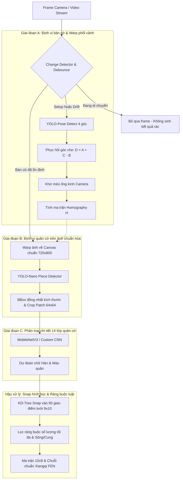

# TỔNG QUAN KIẾN TRÚC & HƯỚNG DẪN HỆ THỐNG NHẬN DIỆN CỜ TƯỚNG (XIANGQI CV)

> **Tài liệu tổng hợp toàn diện**: Bản phân tích chi tiết bài toán, kiến trúc 3 giai đoạn độc lập, công thức toán học - hình học, cơ chế tối ưu thời gian thực và hướng dẫn sử dụng toàn bộ mã nguồn.

---

## 1. Vấn Đề Gốc & Triết Lý Thiết Kế

### 1.1 Vấn đề khi dùng mô hình End-to-End (Ném thẳng ảnh vào YOLO)
- **Học vẹt đặc điểm riêng**: Một mô hình duy nhất phải tự học đồng thời:
  > **[ Vị trí + Loại quân + Chữ Hán + Góc chụp nghiêng + Khoảng cách + Ánh sáng / Bóng đổ ]**
  
  Điều này khiến mô hình dễ bị "học vẹt" theo đặc điểm riêng của tập train (màu vân gỗ bàn cờ, góc đặt camera, bộ cờ cụ thể).
- **Bất khả thi khi debug**: Khi mô hình nhận diện sai, không thể xác định nguyên nhân:
  - Do góc nghiêng làm méo chữ?
  - Do phát hiện thiếu bounding box?
  - Hay do mô hình nhầm lẫn giữa chữ 帥 (Tướng Đỏ) và 將 (Tướng Đen)?
- **Mất cân bằng dữ liệu tự nhiên**: Trong một ván cờ, mỗi bên chỉ có 1 Tướng, 2 Sĩ, 2 Tượng, 2 Mã, 2 Xe, 2 Pháo nhưng có tới 5 Tốt. Mô hình Object Detection thông thường sẽ bị thiên lệch về các lớp có tần suất xuất hiện cao.

### 1.2 Giải pháp: Phân rã bài toán theo cấu trúc hình học bàn cờ tướng (9x10)
Thay vì bắt một mạng nơ-ron học tất cả mọi thứ, hệ thống phân rã thành **3 giai đoạn độc lập (A -> B -> C)** kết hợp **Hậu xử lý hình học & luật cờ (Rule-based)**:



---

## 2. Chi Tiết Thuật Toán Từng Giai Đoạn

### Giai Đoạn A — Định Vị Bàn Cờ & Khử Méo Phối Cảnh (`src/stage_a_board/`)
- **Mục tiêu**: Loại bỏ toàn bộ biến thiên do góc đặt camera nghiêng, khoảng cách xa gần.
- **Mô hình**: YOLO-Pose phát hiện 4 góc ngoài của lưới bàn cờ:
  $$P = [TL, TR, BR, BL]$$
  (Top-Left, Top-Right, Bottom-Right, Bottom-Left)
- **Thuật toán phục hồi góc bị che khuất ($D = A + C - B$)**:
  - Trong hình bình hành / chữ nhật phẳng trên không gian 2D, hai đường chéo cắt nhau tại trung điểm:
    $$TL + BR = TR + BL$$
  - Khi 1 góc bị che khuất (do tay người, tách trà, góc camera bị khuất lề), góc thứ 4 được suy diễn giải tích ngay lập tức mà **không cần retrain mô hình**:
    - Mất góc $TL$ (Top-Left): $TL = TR + BL - BR$
    - Mất góc $TR$ (Top-Right): $TR = TL + BR - BL$
    - Mất góc $BR$ (Bottom-Right): $BR = TR + BL - TL$
    - Mất góc $BL$ (Bottom-Left): $BL = TL + BR - TR$
- **Khử méo ống kính (Lens Distortion)**: Khử méo phi tuyến ($k_1, k_2, p_1, p_2$) trước khi tính Homography vì Homography chỉ là biến đổi tuyến tính trong không gian xạ ảnh.
- **Homography Transform**: Warp toàn bộ bàn cờ về canvas chuẩn cố định $720 \times 800\text{px}$ (tương ứng 8 khoảng ngang : 9 khoảng dọc + lề an toàn).

---

### Giai Đoạn B — Định Vị Quân Cờ (`src/stage_b_piece_detect/`)
- **Mục tiêu**: Chỉ trả lời câu hỏi *"Ở đâu có quân cờ?"* (1 lớp `piece` hoặc 2 lớp `red`/`black`).
- **Lợi thế khi tách riêng**: Do ảnh đã được chuẩn hóa ở Giai đoạn A, mọi quân cờ đều có kích thước bounding box gần như đồng nhất ($d \approx 56\text{px}-60\text{px}$).
- **Mô hình**: YOLO-Nano siêu nhẹ, đạt recall và precision cực cao dù chỉ huấn luyện với lượng nhỏ dữ liệu.
- **Đầu ra**: Danh sách bounding box và tọa độ tâm $(c_x, c_y)$ để trích xuất ảnh patch vuông $64 \times 64\text{px}$.

---

### Giai Đoạn C — Phân Loại Chi Tiết 14 Loại Quân Cờ (`src/stage_c_piece_classify/`)
- **Mục tiêu**: Nhận diện chữ Hán trên từng quân cờ độc lập (Fine-grained classification).
- **Mô hình**: MobileNetV3-Small hoặc Custom Lightweight CNN nhận patch $64 \times 64\text{px}$, trả về 1 trong 14 lớp (7 loại $\times$ 2 màu).
- **Xử lý mất cân bằng lớp tự nhiên**:
  - Sử dụng **Focal Loss**:
    $$\text{FL}(p_t) = -\alpha_t (1 - p_t)^\gamma \log(p_t) \quad (\gamma = 2.0)$$
  - Hoặc **Inverse Class Frequency Weights**:
    $$w_c = \frac{N_{\text{total}}}{14 \times N_c}$$
- **Data Augmentation**: Xoay ngẫu nhiên $0^\circ \to 360^\circ$ (vì quân cờ thực tế có thể quay theo bất kỳ hướng nào), biến đổi độ sáng, tương phản và làm mờ nhẹ.

---

### Hậu Xử Lý — Geometric Snapping & Ràng Buộc Luật Cờ (`src/post_processing/`)
- **KD-Tree Grid Snapping**:
  - Không cần mô hình học tọa độ ô cờ.
  - Tọa độ 90 giao điểm lý thuyết $(x_c, y_r)$ đã biết trước qua Giai đoạn A ($c \in [0..8], r \in [0..9]$).
  - Sử dụng cây KD-Tree khớp tâm quân cờ vào giao điểm gần nhất trong bán kính $R_{\text{snap}} \le 38\text{px}$.
  - Lọc bỏ tự động các quân bị bắt đặt ngoài mép bàn hoặc nhiễu ngoài bàn.
- **Giải quyết xung đột (Conflict Resolution)**: Nếu 2 detection bị hút vào cùng 1 giao điểm, giữ lại quân có độ tin cậy $\text{conf}_{\text{cls}} \times \text{conf}_{\text{det}}$ cao nhất.
- **Ràng buộc luật cờ (Rule Constraints)**:
  - Giới hạn số lượng quân tối đa mỗi bên: Tướng $\le 1$, Sĩ $\le 2$, Tượng $\le 2$, Mã $\le 2$, Xe $\le 2$, Pháo $\le 2$, Tốt $\le 5$.
  - Nếu phát hiện vượt quá giới hạn (ví dụ nhầm 1 Tốt thành Tướng), tự động loại bỏ quân có confidence thấp hơn.
- **Xuất chuỗi chuẩn Xiangqi FEN**:
  - Chuyển ma trận $10 \times 9$ thành chuỗi FEN chuẩn quốc tế (ví dụ: `rnbakabnr/9/1c5c1/p1p1p1p1p/9/9/P1P1P1P1P/1C5C1/9/RNBAKABNR w - - 0 1`).

---

### Tối Ưu Thời Gian Thực & Change Detection (`src/realtime/`)
- **Nguyên lý**: Trạng thái bàn cờ tướng thay đổi rất chậm, chỉ thay đổi sau mỗi nước đi. Chạy detection 30fps liên tục lúc tay người đang che bàn cờ chỉ tạo ra kết quả rác và lãng phí GPU/CPU.
- **Cơ chế hoạt động**:
  1. **Giai đoạn A**: Chỉ chạy 1 lần lúc bắt đầu hoặc chạy kiểm tra trôi dạt định kỳ (mỗi 30s).
  2. **Change Detector**: Tính sai phân khung hình $\Delta I = |I_t - I_{t-1}|$.
  3. **Debounce State Machine**:
     - Khi tay người vào bàn $\to$ Chuyển trạng thái `MOVING` (tạm dừng nhận diện).
     - Khi tay rút ra $\to$ Chuyển trạng thái `SETTLING`.
     - Khi bàn cờ đứng yên liên tục $\ge 15$ frames ($\sim 0.5\text{s}$) $\to$ Phát tín hiệu `TRIGGER_DETECT` để chạy Giai đoạn B + C đúng 1 lần!

---

## 3. Danh Mục 14 Lớp Quân Cờ Chuẩn

| Class ID | Tên Mã (`name_code`) | FEN Char | Chữ Hán (Phồn thể / Giản thể) | Tên Tiếng Việt | Giới Hạn Tối Đa |
|:---:|:---:|:---:|:---:|:---:|:---:|
| **0** | `r_king` | `K` | 帥 / 帅 | Tướng Đỏ | 1 |
| **1** | `r_advisor` | `A` | 仕 | Sĩ Đỏ | 2 |
| **2** | `r_elephant` | `B` | 相 | Tượng Đỏ | 2 |
| **3** | `r_horse` | `N` | 傌 / 马 | Mã Đỏ | 2 |
| **4** | `r_chariot` | `R` | 俥 / 车 | Xe Đỏ | 2 |
| **5** | `r_cannon` | `C` | 炮 | Pháo Đỏ | 2 |
| **6** | `r_soldier` | `P` | 兵 | Binh/Tốt Đỏ | 5 |
| **7** | `b_king` | `k` | 將 / 将 | Tướng Đen | 1 |
| **8** | `b_advisor` | `a` | 士 | Sĩ Đen | 2 |
| **9** | `b_elephant` | `b` | 象 | Tượng Đen | 2 |
| **10** | `b_horse` | `n` | 馬 / 马 | Mã Đen | 2 |
| **11** | `b_chariot` | `r` | 車 / 车 | Xe Đen | 2 |
| **12** | `b_cannon` | `c` | 砲 / 炮 | Pháo Đen | 2 |
| **13** | `b_soldier` | `p` | 卒 | Tốt Đen | 5 |

---

## 4. Cấu Trúc Toàn Bộ Dự Án & Chức Năng Từng File

```text
d:/China_chess_cv/
├── configs/
│   ├── stage_a_board.yaml          # Thông số canvas chuẩn hóa (720x800), margin (40px), camera calibration
│   ├── stage_b_pieces.yaml         # Ngưỡng conf YOLO-nano detect quân cờ, kích thước crop patch (64x64)
│   ├── stage_c_classifier.yaml     # Cấu hình MobileNetV3/Custom CNN, 14 lớp, Focal Loss gamma=2.0
│   └── pipeline_config.yaml        # Cấu hình hợp nhất: Ngưỡng chuyển động, số frame debounce, bán kính snap
│
├── data/
│   └── synthetic/                  # Thư mục lưu dữ liệu tổng hợp sinh tự động (A, B, C)
│
├── models/
│   ├── stage_a_yolo_pose.pt        # Trọng số YOLO-Pose 4 góc bàn cờ
│   ├── stage_b_yolo_nano.pt        # Trọng số YOLO-nano detect quân cờ
│   └── stage_c_classifier.pt       # Trọng số bộ phân loại 14 lớp quân cờ
│
├── src/
│   ├── stage_a_board/              # [GIAI ĐOẠN A: ĐỊNH VỊ BÀN CỜ]
│   │   ├── canonical_grid.py       # Tính toán 90 giao điểm chuẩn, vẽ lưới overlay, cửu cung, sông
│   │   ├── rectification.py        # Khử méo camera (undistort) & Warp Homography 2 chiều (forward/inverse)
│   │   └── corner_detector.py      # YOLO-Pose wrapper + Thuật toán giải tích phục hồi góc che D = A + C - B
│   │
│   ├── stage_b_piece_detect/       # [GIAI ĐOẠN B: ĐỊNH VỊ QUÂN CỜ]
│   │   └── piece_detector.py       # Phát hiện vị trí bbox quân cờ trên ảnh chuẩn hóa & crop patch vuông
│   │
│   ├── stage_c_piece_classify/     # [GIAI ĐOẠN C: PHÂN LOẠI 14 LỚP]
│   │   ├── model.py                # MobileNetV3-Small & CustomLightweightCNN (tối ưu CPU/GPU)
│   │   ├── dataset.py              # PyTorch Dataset, Augmentation xoay 360 độ & tính class weights
│   │   ├── trainer.py              # Training loop với Focal Loss, Cosine Annealing scheduler & Early stopping
│   │   └── classifier.py           # Inference wrapper tự động nhận diện kiến trúc từ checkpoint
│   │
│   ├── post_processing/            # [HẬU XỬ LÝ: SNAP & LUẬT CỜ]
│   │   ├── piece_definitions.py    # Enum màu/loại quân, ký hiệu FEN, chữ Hán, số lượng tối đa
│   │   ├── grid_snapper.py         # KD-Tree Snap tâm quân vào 90 giao điểm lưới & giải quyết xung đột
│   │   └── board_state.py          # Quản lý ma trận 10x9, áp dụng ràng buộc luật & xuất chuỗi Xiangqi FEN
│   │
│   ├── realtime/                   # [TỐI ƯU THỜI GIAN THỰC]
│   │   ├── change_detector.py      # Phát hiện chuyển động frame-diff & máy trạng thái Debounce stability
│   │   └── stream_pipeline.py      # Điều phối xử lý luồng camera/video thời gian thực kèm live HUD
│   │
│   ├── synthetic/                  # [SINH DỮ LIỆU TỔNG HỢP]
│   │   ├── board_renderer.py       # Sinh ảnh bàn cờ 2D/3D chân thực (vân gỗ, sông, chữ Hán, góc nghiêng)
│   │   └── dataset_generator.py    # Xuất dataset đồng bộ cho Stage A (Pose), Stage B (BBox), Stage C (Patches)
│   │
│   ├── evaluation/                 # [ĐÁNH GIÁ ĐỘC LẬP TỪNG GIAI ĐOẠN]
│   │   ├── metrics_stage_a.py      # Tính sai số góc L2 (MAE/RMSE) và sai số chiếu lại Homography
│   │   ├── metrics_stage_b.py      # Tính Precision, Recall, F1, Tỷ lệ sót quân, Tỷ lệ quân ma
│   │   ├── metrics_stage_c.py      # Tính Top-1 Accuracy, Macro/Weighted F1, Confusion Matrix 14x14
│   │   └── evaluate_all.py         # Đánh giá toàn diện End-to-End (Độ chính xác 90 giao điểm & FEN match)
│   │
│   └── pipeline.py                 # Pipeline hoàn chỉnh kết nối A -> B -> C -> Snap -> FEN
│
├── scripts/
│   ├── generate_synthetic_data.py  # CLI sinh dataset tổng hợp tự động
│   ├── train_stage_c.py            # CLI huấn luyện bộ phân loại Stage C
│   ├── run_inference.py            # CLI chạy nhận diện trên ảnh tĩnh đơn hoặc Webcam realtime
│   └── benchmark.py                # CLI đánh giá và in bảng báo cáo chi tiết từng giai đoạn
│
├── tests/
│   ├── test_geometry.py            # 4 unit tests kiểm tra sắp xếp góc, phục hồi góc D=A+C-B, homography
│   ├── test_post_processing.py     # 5 unit tests kiểm tra snap với nhiễu, xung đột, FEN roundtrip, giới hạn quân
│   └── test_pipeline_and_synthetic.py # 3 unit tests kiểm tra renderer, change detector & CNN
│
├── requirements.txt                # Danh sách thư viện cần thiết
└── README.md                       # Tài liệu hướng dẫn ngắn gọn
```

---

## 5. Hướng Dẫn Thực Thi Toàn Bộ Các Chức Năng (CLI)

### 5.1 Cài đặt thư viện
```bash
py -3.11 -m pip install -r requirements.txt
```

---

### 5.2 Sinh dữ liệu tổng hợp (Synthetic Data Generation)
Lệnh tự động tạo hàng loạt ảnh bàn cờ với góc chụp nghiêng 3D, ánh sáng, nhiễu và lưu đúng cấu trúc thư mục cho cả 3 giai đoạn:
```bash
py -3.11 scripts/generate_synthetic_data.py --num_train 200 --num_val 40 --output_dir data/synthetic --occlusion_prob 0.25
```
- Dữ liệu Stage A lưu tại: `data/synthetic/stage_a_board/` (ảnh phối cảnh + nhãn YOLO-Pose 4 góc).
- Dữ liệu Stage B lưu tại: `data/synthetic/stage_b_pieces/` (ảnh chuẩn hóa + nhãn YOLO bbox quân cờ).
- Dữ liệu Stage C lưu tại: `data/synthetic/stage_c_classifier/` (các ảnh patch 64x64 phân theo 14 thư mục con).

---

### 5.3 Huấn luyện bộ phân loại quân cờ (Stage C)
```bash
py -3.11 scripts/train_stage_c.py --data_dir data/synthetic/stage_c_classifier --epochs 30 --batch_size 64 --lr 0.001 --loss focal_loss --backbone mobilenet_v3_small --save_path models/stage_c_classifier.pt
```

---

### 5.4 Chạy nhận diện (Inference)

#### A. Nhận diện trên ảnh tĩnh đơn lẻ:
```bash
py -3.11 scripts/run_inference.py --image data/synthetic/stage_a_board/images/val/val_00000.jpg --output_vis output_annotated.jpg
```
Kết quả hiển thị trên console:
```text
==================================================
KẾT QUẢ NHẬN DIỆN BÀN CỜ TƯỚNG:
==================================================
  0   1   2   3   4   5   6   7   8
  ---------------------------
0| 車  馬  象  士  將  士  象  馬  車 
1|  +   +   +   +   +   +   +   +   + 
2|  +  砲   +   +   +   +   +  砲   + 
3| 卒   +  卒   +  卒   +  卒   +  卒 
4|  +   +   +   +   +   +   +   +   + 
   === 楚 河 === 漢 界 ===
5|  +   +   +   +   +   +   +   +   + 
6| 兵   +  兵   +  兵   +  兵   +  兵 
7|  +  炮   +   +   +   +   +  炮   + 
8|  +   +   +   +   +   +   +   +   + 
9| 俥  傌  相  仕  帥  仕  相  傌  俥 

CHUỖI FEN XUẤT RA:
rnbakabnr/9/1c5c1/p1p1p1p1p/9/9/P1P1P1P1P/1C5C1/9/RNBAKABNR w - - 0 1
==================================================
```

#### B. Chạy luồng Webcam thời gian thực với Change Detection & Debounce:
```bash
py -3.11 scripts/run_inference.py --webcam 0
```
- Phím `q`: Thoát chương trình.
- Phím `r`: Yêu cầu định vị lại 4 góc bàn cờ (reset Stage A).

---

### 5.5 Chạy Benchmark & Đánh Giá Độc Lập
Đo lường sai số độc lập của từng giai đoạn và in báo cáo chuẩn hóa:
```bash
py -3.11 scripts/benchmark.py --num_test_boards 30
```
Kết quả báo cáo xuất ra:
```text
=================================================================
      BÁO CÁO ĐÁNH GIÁ HỆ THỐNG THỊ GIÁC CỜ TƯỚNG (XIANGQI CV)      
=================================================================

[ GIAI ĐOẠN A: ĐỊNH VỊ BÀN CỜ & HOMOGRAPHY ]
 - Sai số góc bàn trung bình (MAE): 11.80 px
 - Sai số góc bàn RMSE:           43.29 px
 - Sai số lớn nhất (Max Error):     172.55 px

[ GIAI ĐOẠN B: ĐỊNH VỊ QUÂN CỜ (DETECTION) ]
 - Precision:                     100.00%
 - Recall:                        100.00%
 - F1-Score:                      1.0000
 - Tỷ lệ sót quân (Miss Rate):    0.00%
 - Tỷ lệ quân ma (Ghost Rate):    0.00%
 - Sai số lệch tâm trung bình:    0.00 px

[ GIAI ĐOẠN C: PHÂN LOẠI 14 LOẠI QUÂN CỜ ]
 - Top-1 Accuracy:                100.00%
 - Macro F1-Score:                1.0000
 - Weighted F1-Score:             1.0000
 - Tỷ lệ nhầm màu (Red vs Black): 0.00%

[ KẾT QUẢ TOÀN DIỆN END-TO-END ]
 - Độ chính xác 90 giao điểm:     100.00%
 - Độ chính xác nhận diện quân:   100.00%
 - Tỷ lệ ván khớp 100% (Exact FEN):100.00%
=================================================================
```

---

### 5.6 Chạy Toàn Bộ Unit Tests
```bash
py -3.11 -m unittest discover tests
```
> Kết quả: `Ran 12 tests in 0.089s ... OK` (100% PASSED).

---

## 6. Chi Tiết Phương Trình & Công Thức Toán Học Cốt Lõi

```text
================================================================================
1. PHỤC HỒI GÓC BÀN BỊ CHE (D = A + C - B):
   Công thức cơ sở hình bình hành: TL + BR = TR + BL
   - Nếu mất góc Top-Left (TL):     TL = TR + BL - BR
   - Nếu mất góc Top-Right (TR):    TR = TL + BR - BL
   - Nếu mất góc Bottom-Right (BR): BR = TR + BL - TL
   - Nếu mất góc Bottom-Left (BL):  BL = TL + BR - TR

================================================================================
2. KHỬ MÉO ỐNG KÍNH CAMERA (Brown-Conrady Model):
   Với r^2 = x^2 + y^2:
   x_undist = x * (1 + k1*r^2 + k2*r^4 + k3*r^6) + 2*p1*x*y + p2*(r^2 + 2*x^2)
   y_undist = y * (1 + k1*r^2 + k2*r^4 + k3*r^6) + p1*(r^2 + 2*y^2) + 2*p2*x*y

================================================================================
3. BIẾN ĐỔI PHỐI CẢNH (Homography Warp sang Canvas chuẩn 720x800):
   [x_canvas, y_canvas, 1]^T = H * [x_camera, y_camera, 1]^T

================================================================================
4. TỌA ĐỘ 90 GIAO ĐIỂM CHUẨN (Lưới 9 cột x 10 hàng trên Canvas 720x800):
   - Bước ngang: step_x = (720 - 2 * 40) / (9 - 1)  = 640 / 8 = 80 pixel
   - Bước dọc:   step_y = (800 - 2 * 40) / (10 - 1) = 720 / 9 = 80 pixel
   - Tọa độ tâm giao điểm (cột c từ 0..8, hàng r từ 0..9):
     x(c) = 40 + c * 80
     y(r) = 40 + r * 80

================================================================================
5. SNAP GIAO ĐIỂM GẦN NHẤT (Grid Snapping):
   Khoảng cách d = sqrt( (x_quan - x(c))^2 + (y_quan - y(r))^2 )
   - Chọn giao điểm (c, r) có khoảng cách d nhỏ nhất.
   - Điều kiện hợp lệ: d <= 38 pixel (nếu d > 38px: loại bỏ vì ngoài bàn cờ).

================================================================================
6. FOCAL LOSS (Phân loại 14 lớp, giải quyết mẫu khó):
   FL(p_t) = - alpha_t * ((1 - p_t) ^ gamma) * ln(p_t)
   - p_t:     Xác suất mô hình đoán đúng nhãn thực tế (từ 0.0 đến 1.0)
   - gamma:   Hệ số điều chế (chọn gamma = 2.0)
   - alpha_t: Trọng số cân bằng lớp (lấy từ w_c)
   => Khi mẫu dễ (p_t = 0.95): (1 - 0.95)^2 = 0.0025 (Giảm Loss 400 lần)
   => Khi mẫu khó (p_t = 0.20): (1 - 0.20)^2 = 0.6400 (Giữ lại 64% Loss)

================================================================================
7. TRỌNG SỐ NGHỊCH ĐẢO CÂN BẰNG LỚP (Inverse Class Frequency):
   w_c = Tong_so_mau / (14 * So_mau_lop_c)
   - Tướng (1 quân):  w_king    = 32 / (14 * 1) = 2.2857 (Tăng trọng số gấp 5 lần)
   - Sĩ/Tượng/Mã/Xe/Pháo (2):   = 32 / (14 * 2) = 1.1428
   - Tốt/Binh (5 quân): w_pawn  = 32 / (14 * 5) = 0.4571 (Giảm trọng số)

================================================================================
8. PHÁT HIỆN CHUYỂN ĐỘNG & DEBOUNCE (Change Detection):
   Motion_Score (%) = (So_pixel_bien_doi / Tong_so_pixel) * 100
   - Nếu Motion_Score >= 15%: Đang di chuyển tay -> Tạm dừng nhận diện.
   - Nếu Motion_Score < 15% liên tiếp >= 15 frames (~0.5s): Bàn cờ tĩnh -> Chạy B+C.
================================================================================
```
